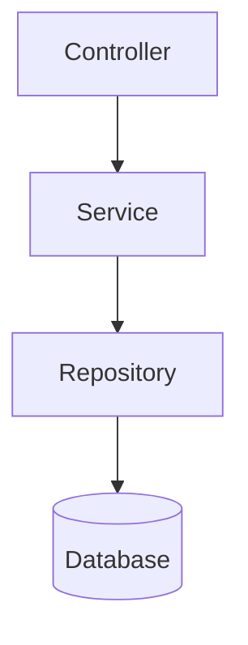

# RepoMind

**Local-first codebase intelligence for understanding, analyzing and working with existing software projects.**

[Live App](https://zainknoman.github.io/RepoMind/) · [GitHub](https://github.com/zainknoman/RepoMind)

> **Open → Index → Understand → Investigate → Analyze → Explain → Document → AI**

RepoMind turns a local repository into a browser-based **codebase intelligence workspace**.

It helps developers understand unfamiliar projects, navigate symbols and dependencies, investigate change impact, inspect Git history, discover APIs, identify architectural signals, generate reports and build grounded context for AI-assisted engineering.

RepoMind is designed around one idea:

> **Make complex software systems easier to understand, investigate and evolve.**

---

## Why RepoMind?

Understanding an existing codebase often requires switching between:

* file explorers,
* text search,
* IDE navigation,
* Git,
* dependency tools,
* architecture diagrams,
* security scanners,
* documentation,
* and AI assistants.

RepoMind brings these activities into one connected workspace.

Instead of treating the repository as a collection of files, RepoMind builds a structured model containing:

```text
Files
  ↓
Symbols
  ↓
References
  ↓
Dependencies
  ↓
Architecture
  ↓
Impact
  ↓
Analysis
  ↓
Reports / Context
  ↓
AI
```

This makes RepoMind a **codebase intelligence workspace**, rather than another general-purpose IDE.

---

# Core capabilities

## 🔎 Codebase Intelligence

After indexing a repository, RepoMind can understand:

* files and languages
* functions
* classes
* methods
* variables
* interfaces
* type aliases
* imports and exports
* definitions
* references
* internal dependencies
* external dependencies
* unresolved imports
* architecture relationships

JavaScript, JSX, TypeScript and TSX use Babel AST parsing with conservative fallback for malformed source.

Additional language analysis is available where supported, including Python, Java and Temenos BASIC. T24 routines are recognised without an extension by their content: upper-case names anywhere, and lower-case names (`BP/account.validate`) inside BASIC source folders such as `BP`, `T24.BP` or `BP.LOCAL`.

---

## 🧩 Symbols

Symbols represent meaningful programming constructs such as:

```text
Function
Class
Method
Variable
Interface
Type
Constant
```

RepoMind can show:

* where a symbol is defined
* where it is referenced
* which files import it
* related dependencies
* potential impact of changing it

References carry confidence information so uncertain relationships are not presented as facts.

---

## 🔗 Dependencies

RepoMind builds dependency relationships between parts of a repository.

It can identify:

* dependency edges
* dependents
* circular dependencies
* dependency hotspots
* unresolved imports
* external dependencies
* architecture relationships

For example:

```text
Controller
    ↓
Service
    ↓
Repository
    ↓
Database
```

This allows developers to investigate how functionality flows through a project.

---

## 💥 Impact Analysis

Impact answers:

> **“If I change this, what could be affected?”**

RepoMind supports:

* file impact
* symbol impact
* transitive impact
* method-call tracing
* changed-symbol analysis
* broken-reference detection
* Git change impact
* confidence levels
* blind-spot reporting

For example:

```text
CustomerService
      ↓
CustomerController
      ↓
Customer API
```

Changing `CustomerService` can therefore be investigated through the dependency and reference graph instead of relying only on text search.

RepoMind deliberately reports **blind spots** where analysis cannot establish a reliable relationship.

---

## ❤️ Health

Health aggregates signals that can indicate areas worth investigating.

Signals include:

* unresolved imports
* unresolved references
* circular dependencies
* parser errors
* dependency hotspots
* external dependency signals

Health is an **engineering signal**, not a claim that a project is objectively "good" or "bad".

---

## 🧪 Analyzers

Analyzers are specialized inspections that examine the repository for a particular purpose.

Current analyzer capabilities include:

* Route Discovery
* Framework Structure
* Symbol Resolution
* Architecture Hotspots
* Secret Scan

Framework-aware analysis includes patterns for:

* React
* Vue
* NestJS
* Spring
* ASP.NET
* FastAPI
* Flask

For **Temenos T24 / Transact** folders, analyzers list routines, applications, services, core
calls, Java links, coding practices and **configuration records**: VERSION, ENQUIRY, EB.API,
PGM.FILE, BATCH and TSA.SERVICE records in DL.DEFINE package exports (`DL.D_<package>` +
`REC000nn`) or as named-field records in a folder named after the application. Each record is
linked to the routines it runs, with the event (validation, input, authorisation, before
authorisation, record id, check record, enquiry build or conversion, API, batch job), so Impact on a
routine shows the VERSIONs, ENQUIRYs and jobs that run it. Field positions follow the
[Temenos-Skills](https://github.com/zainknoman/Temenos-Skills) layouts (checked on real R21
records) unless the repository contains the application's `I_F` insert, which then decides.

Analyzers use a common contract so additional language, framework or domain analyzers can be added without changing the main UI.

See [`docs/ANALYZERS.md`](docs/ANALYZERS.md).

---

## 🛣️ API / Route Discovery

Route Discovery identifies common API declarations in supported frameworks.

Examples include:

```text
GET    /users
POST   /users
GET    /users/:id
DELETE /users/:id
```

Supported patterns include:

* Express
* NestJS
* FastAPI
* Flask
* Spring
* ASP.NET

The purpose is primarily **code navigation and architecture understanding**, not replacing a dedicated API security or testing platform.

---

## 🔐 Security Heuristics

Secret Scan looks for likely:

* API keys
* authentication tokens
* bearer tokens
* passwords
* secrets
* private keys
* database connection strings
* credential environment variables

Detected values are masked in findings and reports.

Security findings are **heuristic signals** and can contain false positives. They should be manually reviewed and are not a replacement for dedicated security tooling.

---

# 🧭 Product structure

RepoMind has two primary workflows.

## Workspace

The Workspace is for navigating and understanding the repository.

| Feature       | Purpose                                                      |
| ------------- | ------------------------------------------------------------ |
| **Dashboard** | Starting point for indexing and investigating the repository |
| **Codebase**  | Main code intelligence workspace                             |
| **Explorer**  | Browse project files                                         |
| **Search**    | Search symbols, paths and source                             |
| **Editor**    | Inspect and edit supported files                             |

## Analyze

Analyze is for deeper investigation and producing reusable artifacts.

| Feature            | Purpose                                          |
| ------------------ | ------------------------------------------------ |
| **Ingest**         | Generate repository summaries and source context |
| **Quick Analysis** | Fast JS/TS structural analysis                   |
| **Transform**      | Combine, split and export project content        |
| **Compare**        | Compare two files                                |
| **Markdown**       | Render Markdown and Mermaid documentation        |

The T24 developer tools (Routine Creator, OFS Message Generator and T24 Log Analyzer) live in
their own app, [T24Tools](https://github.com/zainknoman/T24Tools). RepoMind keeps analysing T24
source code: see [Analyzers](#-analyzers).

---

# 🧠 Codebase workspace

The **Codebase** workspace is the center of RepoMind.

It contains:

```text
Overview
Symbols
Dependencies
Impact
Health
Analyzers
Git
Diagram
Reports
Context Builder
AI
```

These are not independent utilities.

They are different views over the same underlying **codebase intelligence model**.

```text
                    LOCAL REPOSITORY
                           │
                           ▼
                        INDEX
                           │
            ┌──────────────┼──────────────┐
            ▼              ▼              ▼
         Symbols      References      Files
            │              │              │
            └──────────────┼──────────────┘
                           ▼
                     Dependencies
                           │
              ┌────────────┼────────────┐
              ▼            ▼            ▼
           Impact        Health      Analyzers
              │            │            │
              └────────────┼────────────┘
                           ▼
                  Diagrams + Reports
                           │
                           ▼
                    Context Builder
                           │
                           ▼
                           AI
```

---

# 📊 Architecture visualization

RepoMind generates dependency diagrams using Mermaid.

Diagrams can be:

* generated
* re-rendered
* copied
* downloaded

Mermaid is bundled with RepoMind and loaded when visualization is requested.

Example:



---

# 🌿 Git intelligence

RepoMind reads Git information directly from the local `.git` directory.

It can expose:

* current branch
* HEAD
* remote information
* working-tree signals
* recent reflog activity
* commit history
* changed files
* commit impact

Git data is not added to the code index.

### Change Impact

RepoMind can investigate:

```text
Changed files
      ↓
Changed symbols
      ↓
References
      ↓
Affected files
      ↓
Potential impact
```

Change-impact reports can be copied or downloaded as Markdown for reviews and pull requests.

- **Tests to run:** test files (by naming convention: `*.test.*`, `__tests__/`, `test_*.py`,
  `*Test.java`, `*_test.go`, …) that use a changed symbol, import a changed file, or changed
  themselves. Symbol impact lists them too.
- **Commits are traced against their own code:** Impact on an older commit indexes the
  repository as it was at that commit (read from `.git`), so symbols renamed or removed since
  are still followed. Untick the option to use today's index instead (faster).
- The Git view's **Modified** count compares file content with the commit, not timestamps.

Historical analysis explicitly reports blind spots when the required source is unavailable.

---

# 📝 Reports

Reports convert repository intelligence into reusable documentation.

### Project Report

Can contain:

* technology profile
* files and languages
* symbols
* references
* imports and exports
* dependencies
* external dependencies
* circular dependencies
* unresolved imports
* unresolved references
* parser errors
* API surface
* security findings
* dependency hotspots
* review recommendations
* analysis limitations

### Module Report

Provides focused information for a selected file:

* language
* lines
* estimated tokens
* symbols
* imports
* exports
* resolved dependencies

Reports can be edited, copied and downloaded.

---

# 🧩 Context Builder

Context Builder answers:

> **“What information from this repository should be used for this task?”**

Instead of sending an entire repository to an AI, you can select relevant files and optionally expand the context through dependencies/importers.

Typical workflow:

```text
Build Index
    ↓
Select files
    ↓
Include relevant dependencies
    ↓
Review token estimate
    ↓
Generate context
    ↓
Review
    ↓
Copy / Export
    ↓
Use with AI or documentation
```

Saved contexts store the **recipe** — question, selected files and options — rather than repository source.

---

# 🤖 AI

RepoMind provides a provider-neutral, browser-side AI workflow.

Supported providers include:

* OpenAI
* OpenAI-compatible endpoints
* Anthropic
* Google Gemini

The AI workflow is grounded in RepoMind's local codebase intelligence.

A typical request is:

```text
Repository
     ↓
Index
     ↓
Relevant files
     ↓
Symbols / dependencies
     ↓
Analyzer findings
     ↓
Context Builder
     ↓
AI
```

RepoMind can provide the model with:

* repository overview
* repository map
* selected source files
* line numbers
* analyzer findings
* dependency context
* impact information

Credentials-looking values are masked before external AI requests.

AI calls only happen after the user explicitly chooses **Ask AI**.

RepoMind also performs a grounding check on citations returned by the model.

---

# 🔒 Local-first architecture

The core workflow runs in the browser:

```text
Local Folder
     ↓
Browser File System Access API
     ↓
Web Worker
     ↓
Local Codebase Index
     ↓
RepoMind
```

The application has **no backend for the core repository workflow**.

The local index is cached using IndexedDB.

The normal architecture is:

```text
Local Repository
       ↓
     Browser
       ↓
    Local Index
       ↓
   RepoMind UI
```

External network requests are only required when the user explicitly invokes supported external functionality such as AI providers.

---

# 🚀 Getting started

RepoMind is available at:

**https://zainknoman.github.io/RepoMind/**

### Browser requirements

| Browser                         | Support                   |
| ------------------------------- | ------------------------- |
| Chrome / Chromium desktop       | ✅                         |
| Microsoft Edge desktop          | ✅                         |
| Other Chromium desktop browsers | ✅                         |
| Firefox                         | Folder access unavailable |
| Safari                          | Folder access unavailable |
| Mobile browsers                 | Folder access unavailable |

For the complete local repository workflow, use a supported Chromium-based desktop browser.

### Open a repository

1. Open RepoMind.
2. Select **Open Folder**.
3. Choose your project directory.
4. Build the project index.
5. Review the Dashboard.
6. Open **Codebase** to investigate the project.

The header button **System / Light / Dark** chooses the colour theme (System follows the
operating system). The choice is remembered in this browser.

---

# 🛠️ Development

Requires **Node.js 22**.

```powershell
cd frontend
npm ci
npm run dev
```

Available commands:

| Command                | Purpose                       |
| ---------------------- | ----------------------------- |
| `npm run dev`          | Development server            |
| `npm run build`        | Production build              |
| `npm run preview`      | Preview production build      |
| `npm run lint`         | ESLint                        |
| `npm run format`       | Format with Prettier          |
| `npm run format:check` | Check formatting              |
| `npm test`             | Vitest unit tests             |
| `npm run test:e2e`     | Playwright E2E tests          |
| `npm run bench:index`  | Indexer benchmark             |
| `npm run check`        | Format + lint + tests + build |

---

# 🧪 Testing

RepoMind uses:

* **Vitest** for unit and service tests
* **Playwright** for browser E2E testing
* **ESLint** for static analysis
* **Prettier** for formatting
* **Vite** for production builds

The E2E suite runs against the production build so that deployment, base-path, code-splitting and CSP problems are detected before release.

---

# 🏗️ Architecture

```text
frontend/
├── src/
│   ├── components/
│   ├── features/
│   │   ├── dashboard/
│   │   ├── explorer/
│   │   ├── search/
│   │   ├── editor/
│   │   ├── ingest/
│   │   ├── analysis/
│   │   ├── transform/
│   │   ├── compare/
│   │   ├── markdown/
│   │   ├── help/
│   │   └── codebase/
│   ├── lib/
│   └── services/
│       ├── repository.js
│       ├── indexClient.js
│       ├── analyzers.js
│       ├── impact.js
│       ├── changeImpact.js
│       ├── gitObjects.js
│       ├── aiContext.js
│       ├── indexCache.js
│       ├── diagram.js
│       └── ai.js
└── tests/
    └── e2e/
```

The application is intentionally browser-based. The former backend is no longer part of the core product.

---

# 🔐 Privacy

RepoMind follows a local-first model:

* Repository files are processed locally.
* The core application has no backend.
* Git data is read locally.
* The code index is cached in IndexedDB.
* Security findings mask detected credential values.
* AI requests only occur after explicit user action.
* AI context is generated locally before transmission.
* Saved Context Builder entries store selections/options rather than source content.

For security details, see [`SECURITY.md`](SECURITY.md).

---

# 📚 Documentation

| Document                                                 | Purpose                                         |
| -------------------------------------------------------- | ----------------------------------------------- |
| [`docs/CONCEPTS.md`](docs/CONCEPTS.md)                   | RepoMind terminology and product concepts       |
| [`docs/ANALYZERS.md`](docs/ANALYZERS.md)                 | Analyzer architecture and analyzer capabilities |
| [`docs/INDEXER_BENCHMARK.md`](docs/INDEXER_BENCHMARK.md) | Indexing performance                            |
| [`docs/UPGRADE_JOURNEY.md`](docs/UPGRADE_JOURNEY.md)     | Product and architecture evolution              |
| [`docs/PROJECT_AUDIT.md`](docs/PROJECT_AUDIT.md)         | Production-readiness audit                      |
| [`SECURITY.md`](SECURITY.md)                             | Security model and reporting                    |
| [`CONTRIBUTING.md`](CONTRIBUTING.md)                     | Contribution guidelines                         |
| [`CHANGELOG.md`](CHANGELOG.md)                           | Release history                                 |

---

# 🧭 Product direction

RepoMind should remain focused on:

> **Codebase understanding + developer intelligence**

Future areas may include:

* more precise language-aware symbol resolution
* deeper framework-specific analyzers
* richer Git/change-impact analysis
* additional architecture visualizations
* language analyzer packs
* domain-specific analyzer packs
* stronger AI investigation workflows

The goal is not to become another general-purpose IDE.

The goal is to make **existing software easier to understand, investigate and evolve**.

---

## License

Copyright (c) 2026 Zainknoman Software Services. All rights reserved.

See [`LICENSE`](LICENSE).
