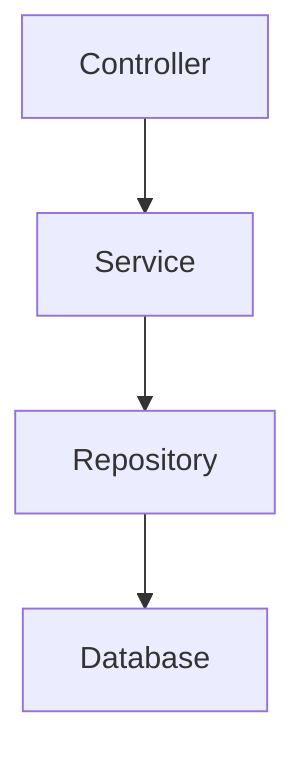

# RepoMind Concepts

This document explains the terminology, architecture and mental model behind RepoMind.

The README explains **what RepoMind is**.

This document explains **what its concepts mean and how they connect**.

---

# 1. The RepoMind mental model

RepoMind is a **codebase intelligence workspace**.

It starts with an existing repository and builds a structured understanding of that repository.

```text
LOCAL REPOSITORY
       │
       ▼
     INGEST
       │
       ▼
     INDEX
       │
       ├── Files
       ├── Symbols
       ├── References
       ├── Imports
       ├── Exports
       └── Metadata
       │
       ▼
 CODEBASE MODEL
       │
       ├── Dependencies
       ├── Architecture
       ├── Impact
       ├── Health
       ├── Analyzers
       └── Git
       │
       ▼
   EXPLANATION
       │
       ├── Diagrams
       ├── Reports
       └── Documentation
       │
       ▼
 CONTEXT BUILDER
       │
       ▼
      AI
```

The important idea is that RepoMind's features are connected.

**Symbols, dependencies, impact, analyzers, Git, reports and AI are different views over shared repository intelligence.**

---

# 2. Repository

A **repository** is the software project being investigated.

For example:

```text
RepoMind/
├── frontend/
├── docs/
├── .github/
└── README.md
```

RepoMind treats the repository as the primary unit of analysis.

---

# 3. File

A **file** is a physical object in the repository.

Examples:

```text
src/App.jsx
src/services/repository.js
package.json
README.md
```

Files provide the basic structure from which RepoMind builds higher-level intelligence.

---

# 4. Ingest

**Ingest** means bringing repository information into RepoMind's processing pipeline.

Conceptually:

```text
Folder
  ↓
Read file metadata
  ↓
Read supported source
  ↓
Parse
  ↓
Analyze
  ↓
Index
```

The Ingest workspace also provides Gitingest-style summaries, directory trees and combined source context.

---

# 5. Index

The **index** is RepoMind's structured representation of the repository.

It contains information such as:

* files
* languages
* lines
* bytes
* estimated tokens
* symbols
* definitions
* references
* imports
* exports
* dependencies
* unresolved imports
* architecture relationships

The index allows later operations to avoid repeatedly scanning every file.

---

# 6. AST

**AST** means **Abstract Syntax Tree**.

An AST represents source code as structured programming constructs instead of plain text.

For:

```javascript
function calculateBalance(account) {
    return account.credit - account.debit;
}
```

the parser can understand:

```text
Function
├── name: calculateBalance
├── parameter: account
└── return
    └── subtraction
        ├── account.credit
        └── account.debit
```

AST information makes it possible to identify programming constructs more reliably than simple text matching.

RepoMind uses Babel AST parsing for JavaScript-family source where supported.

---

# 7. Symbol

A **symbol** is a meaningful programming construct.

Examples:

```javascript
function calculateBalance() {}
```

`calculateBalance` is a function symbol.

```javascript
class CustomerService {}
```

`CustomerService` is a class symbol.

Other symbol types can include:

* functions
* classes
* methods
* variables
* interfaces
* type aliases
* constants
* routines

Symbols form the foundation of code navigation and reference analysis.

---

# 8. Definition

A **definition** is where a symbol is declared or implemented.

Example:

```javascript
export function createCustomer() {
    ...
}
```

RepoMind records the definition of `createCustomer` at that source location.

---

# 9. Reference

A **reference** is a use of a symbol somewhere else.

Example:

```javascript
import { createCustomer } from "./customer.js";

createCustomer(data);
```

The import and call create relationships to the `createCustomer` definition.

RepoMind uses these relationships for navigation and impact analysis.

---

# 10. Reference confidence

Not every reference can be resolved with absolute certainty.

RepoMind therefore associates confidence with references.

| Confidence | Meaning                                                    |
| ---------- | ---------------------------------------------------------- |
| **High**   | Strongly resolved through imports or declarations in scope |
| **Medium** | Several possible targets exist                             |
| **Low**    | Best-effort or guessed relationship                        |
| **None**   | Unresolved                                                 |

This prevents uncertain analysis from being presented as certain fact.

---

# 11. Import

An **import** means one module depends on something provided by another module.

Example:

```javascript
import CustomerService from "./CustomerService.js";
```

This creates a relationship:

```text
CustomerController
        ↓
CustomerService
```

---

# 12. Export

An **export** makes a symbol available to other modules.

Example:

```javascript
export function createCustomer() {}
```

Another file can then import it.

Exports therefore help RepoMind connect symbols across files.

---

# 13. Dependency

A **dependency** is a relationship in which one part of a project relies on another.

Example:

```text
Controller
    ↓
Service
    ↓
Repository
```

RepoMind can identify:

* dependency edges
* dependents
* circular dependencies
* hotspots
* unresolved relationships
* external dependencies

---

# 14. Dependency graph

The **dependency graph** represents repository relationships as a graph.

```text
A ──→ B
│     │
│     └──→ D
└──→ C
```

Nodes can represent files or other analyzed entities.

Edges represent dependency relationships.

This graph powers:

* dependency views
* impact analysis
* architecture visualization
* parts of Context Builder
* Git change impact

---

# 15. Circular dependency

A circular dependency occurs when dependencies eventually point back to an earlier node.

Example:

```text
A → B → C → A
```

Circular dependencies can make systems harder to reason about and are therefore exposed as health signals.

---

# 16. Dependency hotspot

A dependency hotspot is an area with unusually high connectivity.

For example:

```text
        A
        ↓
B → CustomerService ← C
        ↑
        D
        ↑
        E
```

`CustomerService` has many relationships and may deserve additional attention when changes are made.

A hotspot is an **investigation signal**, not automatically a defect.

---

# 17. Impact

Impact analysis answers:

> **What could be affected if this changes?**

For example:

```text
CustomerService
      ↓
CustomerController
      ↓
POST /customers
```

Changing `CustomerService` may affect the controller and API flow.

---

# 18. Direct impact

If:

```text
A → B
```

then B is directly related to A.

Direct impact is the first level of relationship tracing.

---

# 19. Transitive impact

Consider:

```text
A → B → C → D
```

Changing D can potentially affect:

```text
C
B
A
```

This is transitive impact.

RepoMind can trace impact through multiple levels where the graph supports the relationship.

---

# 20. Blind spot

A **blind spot** is an area where RepoMind cannot establish a reliable relationship.

Examples include:

* unsupported language analysis
* unresolved references
* dynamic calls
* computed property names
* unknown object types
* binary files
* very large files
* unavailable historical source

A blind spot is important because:

> **No reported impact does not necessarily mean no impact exists.**

RepoMind explicitly surfaces analysis limitations instead of hiding them.

---

# 21. Health

Health is a collection of signals describing areas worth investigating.

Examples:

```text
Unresolved imports
Unresolved references
Circular dependencies
Parser errors
Dependency hotspots
External dependency signals
```

Health is not intended to be an absolute measure of software quality.

---

# 22. Analyzer

An **analyzer** is specialized logic that examines the repository for a specific purpose.

Current examples include:

```text
Route Discovery
Framework Structure
Symbol Resolution
Architecture Hotspots
Secret Scan
```

The analyzer architecture uses a common contract so new analyzers can be added independently.

---

# 23. Framework analyzer

Framework analyzers recognize common patterns used by frameworks.

RepoMind currently has patterns for:

* React
* Vue
* NestJS
* Spring
* ASP.NET
* FastAPI
* Flask

These are heuristic analyses.

They should not be treated as compiler-level framework verification.

---

# 24. Route Discovery

Route Discovery searches source code for common API route declarations.

For example:

```javascript
router.get("/customers", ...)
router.post("/customers", ...)
```

can become:

```text
GET  /customers
POST /customers
```

The feature is primarily intended for architecture understanding and code navigation.

---

# 25. Secret Scan

Secret Scan searches for patterns that may represent credentials.

Potential findings include:

```text
API keys
Passwords
Tokens
Bearer tokens
Private keys
Database connection strings
Credential environment variables
```

Detected values are masked.

The scanner is heuristic and can produce false positives.

---

# 26. Git intelligence

Git intelligence adds version-control information to codebase analysis.

RepoMind can inspect:

* branch
* HEAD
* remote information
* working-tree signals
* reflog activity
* commits
* changed files

Git information is read from the local `.git` directory.

---

# 27. Change Impact

Change Impact combines Git changes with the codebase graph.

The conceptual flow is:

```text
Git change
    ↓
Changed files
    ↓
Changed symbols
    ↓
Dependency/reference graph
    ↓
Potentially affected code
    ↓
Impact report
```

This makes Git history useful for understanding engineering consequences rather than simply viewing commit messages.

---

# 28. Diagram

A **Diagram** converts repository relationships into a visual representation.

Example:



RepoMind uses Mermaid for architecture/dependency visualization.

---

# 29. Report

A **Report** converts analysis into reusable human-readable documentation.

A project report can contain:

```text
Technology profile
Files
Languages
Symbols
References
Dependencies
APIs
Security findings
Health signals
Architecture information
Limitations
```

Reports can be copied or downloaded.

---

# 30. Context

**Context** is the subset of repository information relevant to a particular task.

Suppose a repository contains:

```text
10,000 files
```

but the question is:

> "How does customer creation work?"

Relevant context might be:

```text
CustomerController
CustomerService
CustomerRepository
Customer model
POST /customers
related tests
```

Context is therefore **task-specific repository information**.

---

# 31. Context Builder

Context Builder creates a structured context from selected repository information.

Typical workflow:

```text
Select files
     ↓
Optional dependency expansion
     ↓
Estimate tokens
     ↓
Generate context
     ↓
Review
     ↓
Copy / Export
```

It can be used independently of AI.

For example, context can be used for:

* code review
* documentation
* architecture review
* external AI tools
* technical discussions

---

# 32. Repository map

The repository map gives an AI a compact representation of what exists in the project.

Conceptually:

```text
src/
├── services/
│   ├── CustomerService.js
│   │   ├── createCustomer()
│   │   └── updateCustomer()
│   └── PaymentService.js
└── controllers/
    └── CustomerController.js
```

This helps an AI understand the structure before consuming detailed source.

---

# 33. AI

AI sits on top of RepoMind's repository intelligence.

The intended flow is:

```text
Question
   ↓
Relevant files
   ↓
Repository map
   ↓
Symbols
   ↓
Dependencies
   ↓
Analyzer findings
   ↓
Source + line numbers
   ↓
AI
```

The AI is therefore not expected to independently discover the entire repository.

RepoMind prepares grounded context first.

---

# 34. Grounded AI

A grounded answer is an AI answer constrained by repository context provided by RepoMind.

RepoMind can provide:

* repository overview
* repository map
* selected source
* line numbers
* analyzer findings
* impact information
* dependency information

The AI is instructed to cite repository locations.

RepoMind then checks citations against the available repository/index information.

---

# 35. Local-first

**Local-first** means core repository processing happens on the user's machine/browser.

The architecture is:

```text
Your computer
     │
     ▼
Local repository
     │
     ▼
Browser
     │
     ├── Parse
     ├── Index
     ├── Search
     ├── Analyze
     ├── Diagram
     └── Report
```

The repository does not need to be uploaded to a RepoMind backend.

This is particularly relevant for proprietary and enterprise source code.

---

# 36. Web Worker

A Web Worker allows expensive processing to happen away from the main browser UI thread.

Instead of:

```text
UI
 ↓
Parse thousands of files
 ↓
UI freezes
```

RepoMind can use:

```text
UI Thread
    │
    └── Web Worker
            │
            ├── Parse
            ├── Index
            └── Analyze
```

This helps keep the interface responsive during indexing.

---

# 37. IndexedDB

IndexedDB is browser-side persistent storage.

RepoMind uses it for index caching.

Conceptually:

```text
Repository
     ↓
Index
     ↓
IndexedDB
     ↓
Restore / reuse
```

The cache stores analysis metadata rather than repository source.

Changed files are reprocessed while unchanged analysis can be reused.

---

# 38. Search

Search answers:

> **Where is this information?**

RepoMind's Search workspace can search:

* symbols
* file paths
* source text

It supports options such as:

* regex
* match case

Search and Codebase intelligence complement one another:

```text
Search
"What contains this?"

Symbols
"What programming entity is this?"

Dependencies
"What is connected to this?"

Impact
"What could this change affect?"
```

---

# 39. Explorer

Explorer answers:

> **Where is everything?**

It provides a navigable view of the repository's files and directories.

For example:

```text
src/
├── components/
├── features/
├── services/
└── utils/
```

Explorer is structural navigation, while Search is discovery.

---

# 40. Editor

The Editor provides direct inspection and editing of supported source files.

Its role in RepoMind is primarily investigative:

```text
Search
   ↓
Symbol
   ↓
Impact
   ↓
File
   ↓
Editor
```

RepoMind is not trying to replace a full IDE.

---

# 41. Compare

Compare identifies differences between two files.

It is useful for:

* reviewing changes
* understanding refactoring
* comparing implementations
* investigating differences

The result is a line-oriented diff.

---

# 42. Transform

Transform converts repository content between useful forms.

Examples include:

```text
Files
  ↓
Combined bundle
```

and:

```text
Combined bundle
  ↓
Individual files
```

It can also export project content as ZIP.

---

# 43. Markdown

Markdown provides a documentation surface inside RepoMind.

It can render:

* Markdown
* code
* Mermaid diagrams

This allows repository intelligence and generated documentation to be viewed together.

---

# 44. Quick Analysis

Quick Analysis is a lightweight structural scan.

For JavaScript/TypeScript files it can provide information such as:

* line counts
* functions
* classes
* imports
* exports

It is intentionally faster and simpler than the full Codebase index.

Use:

```text
Quick Analysis
```

for a fast scan.

Use:

```text
Codebase → Build Index
```

for full repository intelligence.

---

# 45. Dashboard

Dashboard is the investigation starting point.

Its conceptual workflow is:

```text
Open
  ↓
Index
  ↓
Understand
  ↓
Investigate
  ↓
Analyze
  ↓
Report / AI
```

It can highlight issues such as:

* unresolved imports
* dependency cycles
* hotspots
* parser errors

and provide navigation into the relevant Codebase views.

---

# 46. The feature relationships

The most important relationship in RepoMind is:

```text
                 REPOSITORY
                     │
                     ▼
                  INDEXER
                     │
        ┌────────────┼────────────┐
        ▼            ▼            ▼
      FILES       SYMBOLS     REFERENCES
        │            │            │
        └────────────┼────────────┘
                     ▼
               DEPENDENCIES
                     │
        ┌────────────┼────────────┐
        ▼            ▼            ▼
      IMPACT       HEALTH      ANALYZERS
        │            │            │
        └────────────┼────────────┘
                     ▼
             GIT + ARCHITECTURE
                     │
             ┌───────┴────────┐
             ▼                ▼
          DIAGRAMS          REPORTS
             │                │
             └───────┬────────┘
                     ▼
              CONTEXT BUILDER
                     │
                     ▼
                    AI
```

---

# 47. The RepoMind vocabulary

| Term                 | Meaning                                             |
| -------------------- | --------------------------------------------------- |
| **Repository**       | Software project being analyzed                     |
| **File**             | Physical project file                               |
| **Index**            | Structured representation of repository information |
| **AST**              | Structured representation of source code            |
| **Symbol**           | Meaningful programming construct                    |
| **Definition**       | Location where a symbol is declared/implemented     |
| **Reference**        | Usage of a symbol                                   |
| **Import**           | Dependency brought into a module                    |
| **Export**           | Symbol exposed to other modules                     |
| **Dependency**       | Relationship between software components            |
| **Dependency graph** | Graph of repository relationships                   |
| **Impact**           | Potentially affected code                           |
| **Blind spot**       | Relationship RepoMind cannot reliably determine     |
| **Health**           | Collection of investigation signals                 |
| **Analyzer**         | Specialized repository inspection                   |
| **Git intelligence** | Version-control information                         |
| **Change Impact**    | Git changes combined with code intelligence         |
| **Diagram**          | Visual representation of relationships              |
| **Report**           | Human-readable analysis output                      |
| **Context**          | Repository information relevant to a task           |
| **Context Builder**  | Tool for constructing reusable context              |
| **Repository map**   | Compact representation of project structure         |
| **Grounded AI**      | AI working from explicit repository context         |
| **Ingest**           | Bringing repository data into processing            |
| **Transform**        | Converting repository content into another form     |
| **Local-first**      | Core processing happens locally                     |
| **Web Worker**       | Background browser processing                       |
| **IndexedDB**        | Browser-side persistent storage                     |
| **Search**           | Find symbols, paths and source                      |
| **Explorer**         | Browse repository structure                         |
| **Editor**           | Inspect/edit supported files                        |
| **Quick Analysis**   | Lightweight structural analysis                     |

---

# 48. The one-sentence definition

If someone asks:

> **What exactly is RepoMind?**

Use:

> **RepoMind is a local-first codebase intelligence workspace that builds a structured understanding of an existing repository and uses that intelligence for search, dependency analysis, impact analysis, health signals, specialized analyzers, Git investigation, architecture visualization, reporting and grounded AI-assisted engineering.**

---

# 49. The product philosophy

RepoMind is not primarily trying to answer:

> "Where do I write code?"

It is trying to answer:

> **"How does this existing software work, what is connected to what, what could change, and how can I understand it quickly?"**

That distinction defines the product.

```text
Traditional IDE

Write → Run → Debug → Refactor


RepoMind

Open → Index → Understand → Investigate
             ↓
        Analyze → Explain
             ↓
       Document → AI
```

The long-term product direction should therefore remain centered on:

**Codebase Understanding + Developer Intelligence**
